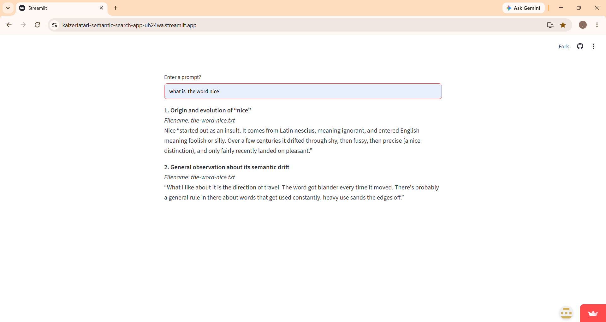

# What it does?
This program gets input from the user and returns an answer based on the embeds /docs text files, top 3 chunks that are similar to the input. It uses the groq client alongside these chunks, user input and grounding instruction to generate an answer.

# URL
https://kaizertatari-semantic-search-app-uh24wa.streamlit.app/
 add: 
# Limitation
The top-3 is chosen by rank rather than relevance.
EXAMPLES
1.What is the nicest way to debug?
A correct answer should only use debugging.txt. The model turned self-report.txt into a debugging device.

2.How to self report?
Should only return self-report.txt but debugging.txt is returned because it is in the top 3.

# Note
The corpus is a generated sample text.

# PREREQUISITE
You need a GROQ_API_KEY stored in secrets on the streamlit app.

# How to run it?
 1. clone the repo.
 2. Create and activate a venv. 
 3. pip install -r requirements.txt 
 4. create .env with the key (GROQ_API_KEY=your_key_here) 
 PC: load_dotenv() reads the local .env file.
 APP:Store the key in streamlit cloud's secret.
 5.  streamlit run app.py
